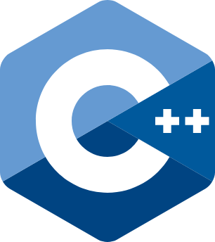

    

        
    

    

            <h3><b>Argus</b></h3>
            
<i>Integrity Through Intelligent Vision 👁️</i>

    

 
<h1 align="center">Argus - Sicat Team - Samsung Innovation Campus Batch 7 - Stage 3</h1>

 

Argus is a next-generation AI + IoT proctoring system designed to maintain academic integrity through real-time intelligent monitoring.

It integrates Computer Vision, Speech Recognition, and IoT sensors to detect abnormal user behavior such as whispering, unauthorized talking, suspicious movements, and so on.

Video Demo Link: 
...

---

## ⚙️ Technology Stack

<kbd></kbd>
<kbd></kbd>
<kbd></kbd>
<kbd></kbd>
<kbd></kbd>

<h4>ESP32 | C++ (.ino) | Python | Computer Vision | Speech Recognition | Streamlit</h4>

---

## 🧩 Core Features

### 👁️ Real-Time Computer Vision Monitoring

Argus uses a trained ResNet-based CNN model to detect:
- Suspicious head/eye movements
- Unauthorized presence
- Strange posture or look-away events
- Possible cheating behaviors

🔍 *AI-powered visual integrity.*

---

### 🎙️ Whispering & Speech Detection (Audio AI)

Argus integrates sound-based classification with 3 custom labels:
- Silence (Clean No Sound)
- Whispering (Suspicious)
- Normal Conversation

This allows the system to differentiate harmless dialogue from cheating behavior.

🎧 *Noise-aware, environment-aware speech intelligence.*

---

### 🌐 IoT Camera & Microphone Data Streaming

The ESP32 sends camera frames and audio packets to the backend using:
- HTTP streaming
- WiFi-based segmented audio uploads

Backend runs AI inference on the received data and updates the dashboard in real-time.

📡 *Lightweight, responsive IoT integration.*

---

### 📊 Streamlit Real-Time Dashboard

Argus features a modern, clean dashboard including:
- Live camera feed
- Real-time speech recognition output
- Action logs & event alerts
- System status monitoring

📈 *Fast & interactive monitoring experience.*

---

### 🌩 Backend with FastAPI

FastAPI handles:
- Image inference endpoint (/vision)
- Audio classification endpoint (/upload)
- Latest prediction retrieval (/latest)
- Real-time streaming compatibility

⚡ *Secure and ultra-fast backend processing.*

---

## 🧰 Getting Started

### Hardware Requirements

- ESP32 Microcontroller
- ESP32-Cam
- INMP411 Ominichannel Microphone
- LED
- Buzzer
- Push Button
- Breadboard + Jumper Cables

---

## 🚀 Software Workflow

1. ESP32 captures camera frames → Sends to FastAPI endpoint
2. ESP32 microphone records audio segments → Uploads WAV packets
3. FastAPI performs:
    - Computer Vision inference (ResNet)
    - Speech Recognition inference (MLP/RandomForest)
4. Streamlit dashboard pulls the latest AI results
5. System displays:
    - Alerts
    - Labels
    - Logs
    - Live monitoring

---

## 🔗 How to Run The Code

Clone the GitHub Repository then follow this documentation

> [!TIP]
> 
> Clone the GitHub Repository then follow this documentation. Then, pip install requirements.txt or you can also make a virtual environment for this (it is up to you).

### Computer Vision Module

1. Change directory to Computer Vision Module.
2. python extract_feature.py to re-run and get the dataset label.
3. python train_mdodel_3.py to train the model.
4. python test_model.py to test and run the model.

### Speech Recognition Module

1. Change directory to Speech Recognition Module.
2. python extract_features.py to re-run and get the dataset label. (To run this you should have ffmpeg on your local machine)
3. python train_and_evaluate_full.py --csv audio_dataset_final.csv --out_dir models_output_final to train and evaluate the model
4. Run the speech-recog-ai-notebook.ipynb to get the visualization of the evaluation model.

### FastAPI Server

1. Change directory to the Root Folder.
2. python fastapi_server_final.py to run the last fixed and final fusion of Speech and Vision AI Module.
3. The FastAPI will succedd run locally on your machine and you can use the endpoint as written in the code.

### Streamlit Dashboard

1. Change directory to the Root Folder.
2. streamlit run streamlit_dashboard_final.py to run the final version of Streamlit Dashboard.
3. Make sure the FastAPI Server already run to test the Speech and Vision Module on the Dashboard.

### IoT .ino Code

1. Change directory to the IoT Folder.
2. There are 2 main files for the IoT which are: esp32_cam.ino and esp32_mic_led_buzzer.ino.
3. You can copy the code and use it in the Arduino IDE.

---

## 📸 &nbsp;Result Preview
<table style="width:100%; text-align:center">
    <col width="100%">
    <tr>
        <td width="1%" align="center"></td>
    </tr>
    <tr>
        <td width="1%" align="center">Streamlit Dashboard - Light Mode</td>
    </tr>
    <tr>
        <td width="1%" align="center"></td>
    </tr>
    <tr>
        <td width="1%" align="center">Streamlit Dashboard - Dark Mode</td>
    </tr>
</table>

---

## 🧭 Diagram

*Overall End-to-end System Workflow of Argus Project*

  

This diagram illustrates how the IoT devices, AI inference modules, backend server, and dashboard interact within the Argus ecosystem.

---

## 👥 Owner

This Repository is created by Team Sicat - Samsung Innovation Campus
<ul>
<li>Stanley Nathanael Wijaya - Team Leader</li>
<li>Clarissa Aditjakra</li>
<li>Jazzlyn Amelia Lim</li>
<li>Visella</li>
</ul>
As Final Project for SIC Batch 7 Stage 3

---

## 📬 Contact
Have questions or want to collaborate?

- 📧 Email: stanley.n.wijaya7@gmail.com
- 💬 Discord: `stynw7`

<code>Made with ❤️ by Team Sicat</code>